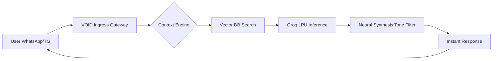

# VOID: The Autonomous Neural Agency
**Executive Briefing & Technical Architecture Deck**
*Prepared for Stakeholders & Strategic Partners*

---

## 1. Executive Summary
VOID is a next-generation "Neural Agency" platform designed to replace traditional human support and sales teams with autonomous, high-fidelity AI operatives. Unlike legacy chatbots, VOID agents are **self-learning, multi-channel (WhatsApp/Telegram), and feature a real-time Human Takeover protocol.** 

Our mission is to provide businesses with a "Synthetic Workforce" that operates with zero latency, 24/7/365, at 1/100th the cost of a human department.

---

## 2. Core Technology Stack
VOID is built on a "Speed-First" architecture to eliminate the "AI lag" that kills user conversion.

- **Inference Engine**: Powered by **Groq LPU (Language Processing Unit)**. We achieve sub-100ms response times using Llama 3 and Mixtral models, making conversations feel truly human.
- **Neural Memory**: Leveraging **Retrieval-Augmented Generation (RAG)**. Operatives don't just "chat"—they query a vectorized knowledge core trained on company-specific data.
- **Integration Layer**: Custom-built webhooks for WhatsApp Business Cloud API and Telegram Bot API.
- **Data Lifecycle**: Automated MongoDB TTL (Time-To-Live) indexing for 30-day data purging, ensuring GDPR/CCPA compliance and system hygiene.

---

## 3. Algorithms & Intelligence Protocols
- **RAG (Retrieval-Augmented Generation)**: We use semantic search to inject relevant context into every prompt, ensuring the AI never hallucinates and always stays on-brand.
- **The Takeover Protocol**: A proprietary state-management algorithm that allows a human admin to "Kill-Switch" the AI in mid-conversation for high-stakes human intervention.
- **Neural Synthesis**: A personality-injection algorithm that calibrates "Tone of Voice" (Professional, Witty, Concise) to match the business's brand identity.

---

## 4. Information Flow (The Neural Loop)

---

## 5. Security, Privacy & Ethics
VOID is designed with a "Privacy-First" directive, crucial for enterprise adoption.
- **PII Scrubbing**: Automatic filtering of sensitive user data before it reaches the inference engine.
- **End-to-End Encryption**: All transmissions from ingress to the database are encrypted using AES-256 protocols.
- **30-Day Auto-Purge**: A hard-coded data lifecycle that prevents the accumulation of stale user data, significantly reducing liability.
- **Sovereign Training**: Knowledge cores are isolated. Knowledge ingested for Company A never influences the operatives of Company B.

---

## 6. Competitive Edge (The "VOID" Advantage)
| Feature | Legacy Bots (Intercom/Zendesk) | VOID Neural Agency |
| :--- | :--- | :--- |
| **Response Speed** | 2-5 Seconds (High Latency) | **<100ms (Instant)** |
| **Human In Loop** | Ticket Escalation (Slow) | **Live Takeover (Instant)** |
| **Training** | Manual Rule-Sets | **Auto-Web Scraping/Doc Ingestion** |
| **UI/UX** | Generic Dashboard | **Premium "Neural Lab" Aesthetic** |
| **Data Privacy** | Indefinite Storage | **30-Day Auto-Purge Protocol** |

---

## 7. Market Research & Strategic Value
### The AI Agent Market
The global AI Agent market is projected to reach **$47 Billion by 2030**. Businesses are moving away from "Basic Chat" toward "Autonomous Operatives" that can actually execute tasks.

### Economic Impact
- **80% Reduction** in support overhead costs.
- **40% Increase** in sales conversion through instant, 24/7 outbound engagement.
- **Zero Training Time**: A VOID agent is fully trained on a 100-page manual in less than 60 seconds.

---

## 8. Target Users & Use Cases
- **E-Commerce (Shopify/DTC)**: Handling complex order tracking and product recommendations on WhatsApp.
- **SaaS (B2B)**: Providing instant technical support and documentation retrieval.
- **High-Ticket Sales**: Initial lead qualification and appointment setting.
- **Internal Knowledge**: Employee-facing bots for HR and Policy lookup.

---

## 9. The Onboarding Lifecycle
1. **Synthesis**: Define the operative's name, tone, and behavioral protocol.
2. **Ingestion**: Upload documents or sync URLs to build the knowledge core.
3. **Uplink**: Connect WhatsApp/Telegram channels and go live in < 5 minutes.

---

## 10. Future Roadmap (The "Synthetics" Era)
- **Phase 1 (Q3 2026)**: **Action Tools** - Operatives will be able to refund orders, book slots, and update CRMs autonomously.
- **Phase 2 (Q4 2026)**: **Neural Voice** - Converting text operatives into high-fidelity voice agents for phone-based support.
- **Phase 3 (2027)**: **Multi-Modal Vision** - Agents will "see" and troubleshoot user screenshots and videos in real-time.

---

## 11. Conclusion
VOID is not a tool; it is a workforce. By combining the speed of Groq, the reliability of RAG, and a premium "Human-First" interface, we are defining the future of how businesses communicate with the world.

**The synthesis has begun.**
