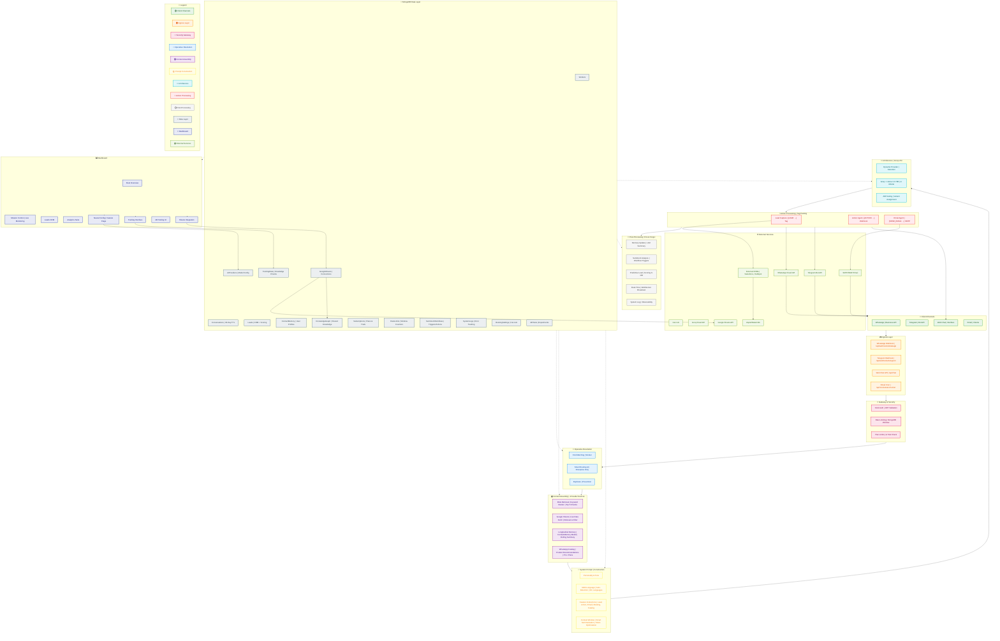

# VOID Platform - Main System Architecture

```mermaid
flowchart TB
    subgraph CLIENTS["🎯 Client Channels"]
        direction LR
        WAB["WhatsApp | Business API"]
        TG["Telegram | Bot API"]
        WEB["Web Chat | Interface"]
        EM["Email | Clients"]
    end

    subgraph INGRESS["📥 Ingress Layer"]
        direction LR
        WA_WH["WhatsApp Webhook | /api/webhooks/whatsapp"]
        TG_WH["Telegram Webhook | /api/webhooks/telegram"]
        WEB_API["Web Chat API | /api/chat"]
        EMAIL_CRON["Email Cron | /api/cron/email-checker"]
    end

    subgraph GATEWAY["🔐 Gateway & Security"]
        AUTH["Clerk Auth | JWT Validation"]
        RATE["Rate Limiting | MongoDB Window"]
        SUBS["Plan Limits | & Trial Check"]
    end

    subgraph OPERATIVE["🧠 Operative Resolution"]
        FIND["Find Matching | Worker"]
        SMART["Smart Routing AI | Enterprise Only"]
        DEDUP["Duplicate | Prevention"]
    end

    subgraph CONTEXT["📚 Context Assembly | 4 Parallel Sources"]
        RAG["RAG Retrieval | Keyword Ranker | Top 5 Chunks"]
        SHEETS["Google Sheets | Live Data Fetch | Relevance Filter"]
        MEMORY["Longitudinal Memory | ContactMemory Model | Rolling Summary"]
        CATALOG["WhatsApp Catalog | Product Recommendations | Pro+ Plans"]
    end

    subgraph PROMPT["⚡ System Prompt | Construction"]
        PERSONA["Personality & Tone"]
        LANG["Multi-Language | Auto-Detection | 30+ Languages"]
        INSTRUCT["Feature Instructions | Lead, Action, Email | Booking, Catalog"]
        WINDOW["Context Window | Smart Summarization | Token Optimization"]
    end

    subgraph INFERENCE["🤖 AI Inference | Groq LPU"]
        PROVIDER["Dynamic Provider | Selection"]
        MODEL["Groq + Llama 3.3 70B | or Mixtral"]
        ABTEST["A/B Testing | Variant Assignment"]
    end

    subgraph ACTIONS["⚡ Action Processing | Tag Parsing"]
        LEAD["Lead Capture | [LEAD: ...] Tag"]
        ACTION["Action Agent | [ACTION: ...] Webhook"]
        EMAIL["Email Agent | [SEND_EMAIL: ...] SMTP"]
    end

    subgraph POST["🔄 Post-Processing | Fire & Forget"]
        MEM_UPD["Memory Update | LLM Summary"]
        SENT["Sentiment Analysis | Workflow Triggers"]
        SCORE["Predictive Lead | Scoring 0-100"]
        BROAD["Real-Time | WebSocket Broadcast"]
        LOG["System Log | Observability"]
    end

    subgraph DATA["💾 MongoDB Data Layer"]
        W[Workers]
        C["Conversations | 30-Day TTL"]
        T["TrainingData | Knowledge Chunks"]
        L["Leads | CRM + Scoring"]
        M["ContactMemory | User Profiles"]
        S["GoogleSheets | Connections"]
        KG["KnowledgeGraph | Shared Knowledge"]
        SUB["Subscriptions | Plans & Trials"]
        RL["RateLimits | Window Counters"]
        WF["SentimentWorkflows | Triggers/Actions"]
        SL["SystemLogs | Error Tracking"]
        P["AIProviders | Model Config"]
        B["BookingSettings | Cal.com"]
        AB["ABTests | Experiments"]
    end

    subgraph DASH["📊 Dashboard"]
        FLEET["Fleet Overview"]
        LIVE["Mission Control | Live Monitoring"]
        LEADS["Leads CRM"]
        ANALYTICS["Analytics Suite"]
        TRAIN["Training Interface"]
        CONFIG["Neural Config | Feature Flags"]
        AB_DASH["AB Testing UI"]
        SHEETS_UI["Sheets Integration"]
    end

    subgraph EXTERNAL["🌐 External Services"]
        WA_API["WhatsApp Cloud API"]
        TG_API["Telegram Bot API"]
        SMTP["SMTP/IMAP Email"]
        CAL["Cal.com"]
        GROQ["Groq Cloud API"]
        GS["Google Sheets API"]
        CRM["External CRMs | Salesforce, HubSpot"]
        ZAPIER["Zapier/Make/n8n"]
    end

    %% === FLOWS ===
    CLIENTS --> INGRESS
    INGRESS --> GATEWAY
    GATEWAY --> OPERATIVE
    OPERATIVE --> CONTEXT
    CONTEXT --> PROMPT
    PROMPT --> INFERENCE
    INFERENCE --> ACTIONS
    ACTIONS --> POST
    
    %% Data dependencies (dotted = read, solid = write)
    DATA -.-> OPERATIVE
    DATA -.-> CONTEXT
    DATA -.-> PROMPT
    DATA -.-> INFERENCE
    DATA -.-> POST
    DATA -.-> DASH
    
    DASH --> CONFIG
    CONFIG --> P
    DASH --> TRAIN
    TRAIN --> T
    DASH --> SHEETS_UI
    SHEETS_UI --> S
    
    %% Action outputs
    ACTIONS --> WA_API
    ACTIONS --> TG_API
    ACTIONS --> WEB
    EMAIL --> SMTP
    
    LEAD --> CRM
    CRM --> ZAPIER
    
    %% Sheets sync
    S --> GS
    S --> KG
    
    %% External responses
    WA_API --> CLIENTS
    TG_API --> CLIENTS
    SMTP --> CLIENTS
    
    %% Styling
    classDef client fill:#e8f5e9,stroke:#4caf50,stroke-width:2px,color:#1b5e20
    classDef ingress fill:#fff3e0,stroke:#ff9800,stroke-width:2px,color:#e65100
    classDef gateway fill:#fce4ec,stroke:#e91e63,stroke-width:2px,color:#880e4f
    classDef operative fill:#e3f2fd,stroke:#2196f3,stroke-width:2px,color:#0d47a1
    classDef context fill:#f3e5f5,stroke:#9c27b0,stroke-width:2px,color:#4a148c
    classDef prompt fill:#fffde7,stroke:#ffeb3b,stroke-width:2px,color:#f57f17
    classDef inference fill:#e0f7fa,stroke:#00bcd4,stroke-width:2px,color:#006064
    classDef actions fill:#ffebee,stroke:#f44336,stroke-width:2px,color:#b71c1c
    classDef post fill:#f5f5f5,stroke:#9e9e9e,stroke-width:2px,color:#424242
    classDef data fill:#eceff1,stroke:#607d8b,stroke-width:2px,color:#37474f
    classDef dash fill:#e8eaf6,stroke:#3f51b5,stroke-width:2px,color:#1a237e
    classDef external fill:#f1f8e9,stroke:#7cb342,stroke-width:2px,color:#33691e
    
    class WAB,TG,WEB,EM client
    class WA_WH,TG_WH,WEB_API,EMAIL_CRON ingress
    class AUTH,RATE,SUBS gateway
    class FIND,SMART,DEDUP operative
    class RAG,SHEETS,MEMORY,CATALOG context
    class PERSONA,LANG,INSTRUCT,WINDOW prompt
    class PROVIDER,MODEL,ABTEST inference
    class LEAD,ACTION,EMAIL actions
    class MEM_UPD,SENT,SCORE,BROAD,LOG post
    class W,C,T,L,M,S,KG,SUB,RL,WF,SL,P,B,AB data
    class FLEET,LIVE,LEADS,ANALYTICS,TRAIN,CONFIG,AB_DASH,SHEETS_UI dash
    class WA_API,TG_API,SMTP,CAL,GROQ,GS,CRM,ZAPIER external
    
    %% Legend
    subgraph LEGEND["📖 Legend"]
        direction LR
        LEG1[🟢 Client Channels]:::client
        LEG2[🟠 Ingress Layer]:::ingress
        LEG3[🩷 Security Gateway]:::gateway
        LEG4[🔵 Operative Resolution]:::operative
        LEG5[🟣 Context Assembly]:::context
        LEG6[🟡 Prompt Construction]:::prompt
        LEG7[🩵 AI Inference]:::inference
        LEG8[🔴 Action Processing]:::actions
        LEG9[⚪ Post-Processing]:::post
        LEG10[🔘 Data Layer]:::data
        LEG11[🔷 Dashboard]:::dash
        LEG12[🟢 External Services]:::external
    end
```
