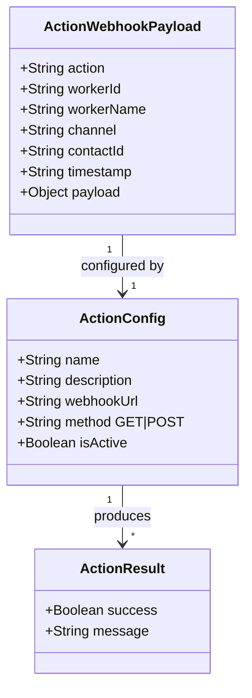

# VOID Platform - Action Agent Execution Flow

How custom action agents execute business logic via webhook firing.

```mermaid
flowchart TD
    subgraph AI_PHASE["🤖 AI Phase"]
        USER_MSG[User Request<br/>e.g. "Refund my order #123"]
        AI_PROCESS[AI Processes with<br/>System Prompt Context]
        AI_KNOWS_ACTIONS[AI Knows Available Actions<br/>from Prompt Instructions]
        AI_OUTPUT[AI Outputs Tagged Response<br/>[ACTION: refund_process, {"id": "123"}]]
    end

    subgraph PARSE_PHASE["📋 Parsing Phase"]
        RESPONSE_RECV[Response Received<br/>from AI Inference]
        TAG_SCAN[Scan for [ACTION:] Tags<br/>Regex Matching]
        MULTI_TAG[Handle Multiple Actions<br/>in Single Response]
        EXTRACT[Extract Action Name<br/>and JSON Data]
    end

    subgraph MATCH_PHASE["🎯 Action Matching"]
        FIND_CONFIG[Find Configured Action<br/>by Name Match]
        NORMALIZE[Normalize Names<br/>for Fuzzy Match]
        CHECK_ACTIVE[Verify Action is Active<br/>and Has Webhook URL]
        FALLBACK[Fallback: Single Action<br/>If Name Missing]
        UNKNOWN[Unknown Action?<br/>Strip Tag Silently]
    end

    subgraph EXECUTE_PHASE["⚡ Execution Phase"]
        PARSE_DATA[Parse JSON Data<br/>from Tag Payload]
        BUILD_PAYLOAD[Build Webhook Payload<br/>Action + Meta + Timestamp]
        FIRE_WEBHOOK[Fire POST Request<br/>to Configured URL]
        WEBHOOK_META[Include Metadata<br/>workerId, workerName, channel, contactId]
        HTTP_RESPONSE[Receive HTTP Response<br/>2xx = Success]
    end

    subgraph RESULT_PHASE["📊 Result Handling"]
        SUCCESS[Success: Replace Tag<br/>with Success Message]
        FAIL_SERVER[Server Error: Replace Tag<br/>with Error Message ⚠️]
        FAIL_NETWORK[Network Error: Replace Tag<br/>with Connection Error ⚠️]
        LOG_RESULT[Log Result to<br/>SystemLog]
        BROADCAST_RESULT[Broadcast Result<br/>via WebSocket]
    end

    subgraph SYSTEM_GUARD["🛡️ System Guard"]
        CHECK_ACTIVE_GUARD[System Guard Active?<br/>Alert on Errors]
        ALERT_THRESHOLD[Alert Threshold<br/>error / warning / info]
        ALERT_PHONE[Send WhatsApp Alert<br/>to Alert Phone Number]
        SYSTEM_LOG_CREATE[Create SystemLog Entry<br/>type: error/handshake]
    end

    %% Flow
    USER_MSG --> AI_PROCESS
    AI_PROCESS --> AI_KNOWS_ACTIONS
    AI_KNOWS_ACTIONS --> AI_OUTPUT
    
    AI_OUTPUT --> RESPONSE_RECV
    RESPONSE_RECV --> TAG_SCAN
    TAG_SCAN --> MULTI_TAG
    MULTI_TAG --> EXTRACT
    
    EXTRACT --> FIND_CONFIG
    FIND_CONFIG --> NORMALIZE
    NORMALIZE --> CHECK_ACTIVE
    CHECK_ACTIVE -->|Active + Webhook| EXECUTE_PHASE
    CHECK_ACTIVE -->|Unknown/Inactive| UNKNOWN
    UNKNOWN -->|Strip & Continue| TAG_SCAN
    
    FALLBACK -.-> CHECK_ACTIVE
    NOTE_RIGHT_FALLBACK[If AI hallucinated name<br/>and only 1 active action exists<br/>use that action]
    
    EXECUTE_PHASE --> PARSE_DATA
    PARSE_DATA --> BUILD_PAYLOAD
    BUILD_PAYLOAD --> FIRE_WEBHOOK
    FIRE_WEBHOOK --> WEBHOOK_META
    WEBHOOK_META --> HTTP_RESPONSE
    
    HTTP_RESPONSE -->|2xx OK| SUCCESS
    HTTP_RESPONSE -->|4xx/5xx| FAIL_SERVER
    HTTP_RESPONSE -->|Network Error| FAIL_NETWORK
    
    SUCCESS --> LOG_RESULT
    FAIL_SERVER --> LOG_RESULT
    FAIL_NETWORK --> LOG_RESULT
    
    LOG_RESULT --> BROADCAST_RESULT
    BROADCAST_RESULT --> SYSTEM_GUARD
    
    SYSTEM_GUARD --> CHECK_ACTIVE_GUARD
    CHECK_ACTIVE_GUARD -->|Active| ALERT_THRESHOLD
    CHECK_ACTIVE_GUARD -->|Inactive| LOG_RESULT
    ALERT_THRESHOLD --> ALERT_PHONE
    ALERT_PHONE --> SYSTEM_LOG_CREATE
    
    %% Styling
    classDef ai fill:#e0f7fa,stroke:#00bcd4,stroke-width:2px,color:#006064
    classDef parse fill:#fffde7,stroke:#ffeb3b,stroke-width:2px,color:#f57f17
    classDef match fill:#e3f2fd,stroke:#2196f3,stroke-width:2px,color:#0d47a1
    classDef execute fill:#ffebee,stroke:#f44336,stroke-width:2px,color:#b71c1c
    classDef result fill:#f3e5f5,stroke:#9c27b0,stroke-width:2px,color:#4a148c
    classDef guard fill:#fff3e0,stroke:#ff9800,stroke-width:2px,color:#e65100
    
    class USER_MSG,AI_PROCESS,AI_KNOWS_ACTIONS,AI_OUTPUT ai
    class RESPONSE_RECV,TAG_SCAN,MULTI_TAG,EXTRACT parse
    class FIND_CONFIG,NORMALIZE,CHECK_ACTIVE,FALLBACK,UNKNOWN match
    class PARSE_DATA,BUILD_PAYLOAD,FIRE_WEBHOOK,WEBHOOK_META,HTTP_RESPONSE execute
    class SUCCESS,FAIL_SERVER,FAIL_NETWORK,LOG_RESULT,BROADCAST_RESULT result
    class CHECK_ACTIVE_GUARD,ALERT_THRESHOLD,ALERT_PHONE,SYSTEM_LOG_CREATE guard
```

## Action Webhook Payload Schema



## Example Action Flow

```
User: "Can you refund order #12345?"

AI System Prompt includes:
  TOOL: refund_process.
  INSTRUCTIONS: Process a refund for a given order ID.
  FORMAT: [ACTION: refund_process, JSON_DATA_HERE]

AI Response:
  I'll process that refund for you right away.
  [ACTION: refund_process, {"orderId": "12345", "reason": "customer_request"}]

Server parses tag:
  actionName = "refund_process"
  actionData = {"orderId": "12345", "reason": "customer_request"}

Server finds configured action:
  name: "refund_process"
  webhookUrl: "https://api.business.com/webhooks/refund"
  method: "POST"
  isActive: true

Server fires webhook:
  POST https://api.business.com/webhooks/refund
  Body: {
    "action": "refund_process",
    "workerId": "abc123",
    "workerName": "Support Bot",
    "channel": "whatsapp",
    "contactId": "+1234567890",
    "timestamp": "2026-09-10T12:00:00Z",
    "payload": {"orderId": "12345", "reason": "customer_request"}
  }

Webhook responds: 200 OK {"status": "refunded", "refundId": "R789"}

Server replaces tag in response:
  "I'll process that refund for you right away.
   ✅ refund_process executed successfully."

Final response sent to user.
```
