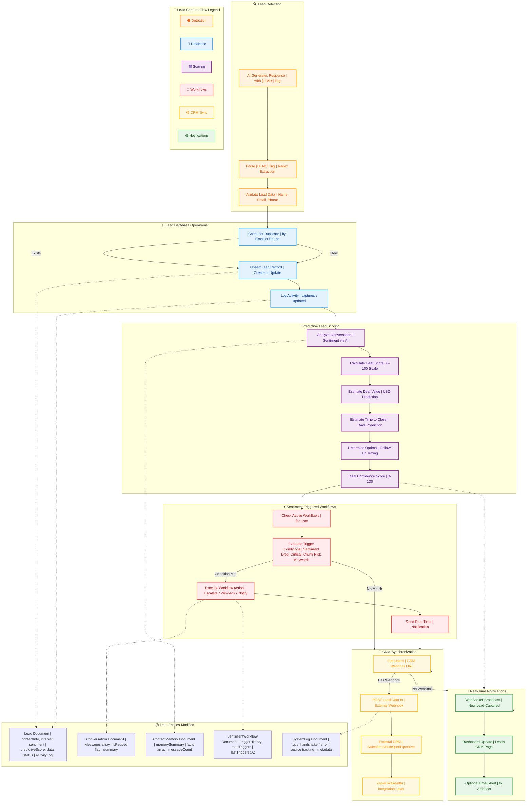
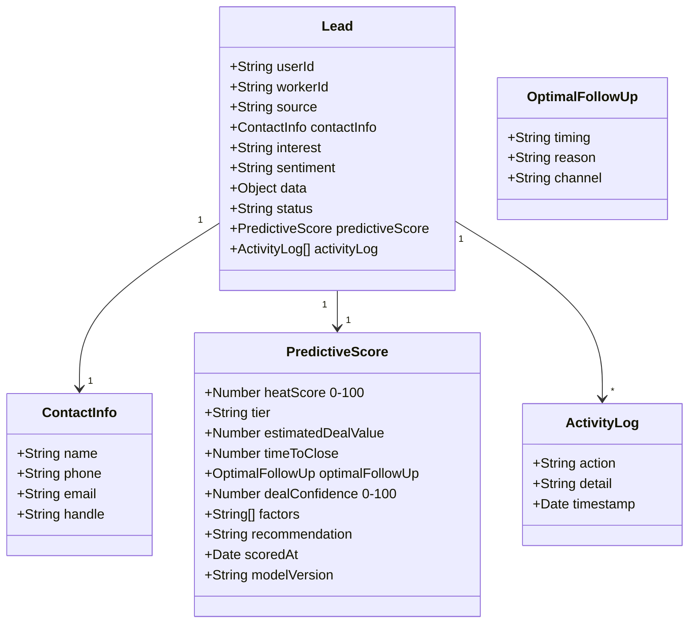

# VOID Platform - Lead Capture Workflow

How leads are detected, captured, scored, and synced to external CRMs.

```mermaid
flowchart TD
    subgraph DETECTION["🔍 Lead Detection"]
        AI_RESPONSE["AI Generates Response | with [LEAD:] Tag"]
        TAG_PARSE["Parse [LEAD:] Tag | Regex Extraction"]
        VALIDATE["Validate Lead Data | Name, Email, Phone"]
    end

    subgraph LEAD_DB["📝 Lead Database Operations"]
        CHECK_DUP["Check for Duplicate | by Email or Phone"]
        UPSERT["Upsert Lead Record | Create or Update"]
        ACTIVITY["Log Activity | captured / updated"]
    end

    subgraph SCORING["🎯 Predictive Lead Scoring"]
        SENTIMENT_ANALYSIS["Analyze Conversation | Sentiment via AI"]
        HEAT_SCORE["Calculate Heat Score | 0-100 Scale"]
        DEAL_VALUE["Estimate Deal Value | USD Prediction"]
        CLOSE_TIME["Estimate Time to Close | Days Prediction"]
        FOLLOWUP["Determine Optimal | Follow-Up Timing"]
        CONFIDENCE["Deal Confidence Score | 0-100"]
    end

    subgraph WORKFLOWS["⚡ Sentiment-Triggered Workflows"]
        CHECK_WORKFLOWS["Check Active Workflows | for User"]
        EVALUATE["Evaluate Trigger Conditions | Sentiment Drop, Critical, Churn Risk, Keywords"]
        EXECUTE["Execute Workflow Action | Escalate / Win-back / Notify"]
        NOTIFY["Send Real-Time | Notification"]
    end

    subgraph CRM_SYNC["🔗 CRM Synchronization"]
        GET_WEBHOOK["Get User's | CRM Webhook URL"]
        SYNC_LEAD["POST Lead Data to | External Webhook"]
        EXTERNAL_CRM["External CRM | Salesforce/HubSpot/Pipedrive"]
        ZAPIER["Zapier/Make/n8n | Integration Layer"]
    end

    subgraph NOTIFICATIONS["📢 Real-Time Notifications"]
        BROADCAST["WebSocket Broadcast | New Lead Captured"]
        DASHBOARD["Dashboard Update | Leads CRM Page"]
        EMAIL_ALERT["Optional Email Alert | to Architect"]
    end

    %% Flow
    AI_RESPONSE --> TAG_PARSE
    TAG_PARSE --> VALIDATE
    
    VALIDATE --> CHECK_DUP
    CHECK_DUP -->|Exists| UPSERT
    CHECK_DUP -->|New| UPSERT
    
    UPSERT --> ACTIVITY
    ACTIVITY --> SENTIMENT_ANALYSIS
    
    SENTIMENT_ANALYSIS --> HEAT_SCORE
    HEAT_SCORE --> DEAL_VALUE
    DEAL_VALUE --> CLOSE_TIME
    CLOSE_TIME --> FOLLOWUP
    FOLLOWUP --> CONFIDENCE
    
    CONFIDENCE --> CHECK_WORKFLOWS
    CHECK_WORKFLOWS --> EVALUATE
    EVALUATE -->|Condition Met| EXECUTE
    EVALUATE -->|No Match| CRM_SYNC
    
    EXECUTE --> NOTIFY
    NOTIFY --> CRM_SYNC
    
    CRM_SYNC --> GET_WEBHOOK
    GET_WEBHOOK -->|Has Webhook| SYNC_LEAD
    GET_WEBHOOK -->|No Webhook| NOTIFICATIONS
    
    SYNC_LEAD --> EXTERNAL_CRM
    EXTERNAL_CRM --> ZAPIER
    
    %% Notifications parallel
    CONFIDENCE -.-> NOTIFICATIONS
    NOTIFICATIONS --> BROADCAST
    BROADCAST --> DASHBOARD
    DASHBOARD --> EMAIL_ALERT
    
    %% Styling
    classDef detection fill:#fff3e0,stroke:#ff9800,stroke-width:2px,color:#e65100
    classDef leaddb fill:#e3f2fd,stroke:#2196f3,stroke-width:2px,color:#0d47a1
    classDef scoring fill:#f3e5f5,stroke:#9c27b0,stroke-width:2px,color:#4a148c
    classDef workflows fill:#ffebee,stroke:#f44336,stroke-width:2px,color:#b71c1c
    classDef crrmsync fill:#fff8e1,stroke:#ffc107,stroke-width:2px,color:#ff8f00
    classDef notify fill:#e8f5e9,stroke:#4caf50,stroke-width:2px,color:#1b5e20
    
    class AI_RESPONSE,TAG_PARSE,VALIDATE detection
    class CHECK_DUP,UPSERT,ACTIVITY leaddb
    class SENTIMENT_ANALYSIS,HEAT_SCORE,DEAL_VALUE,CLOSE_TIME,FOLLOWUP,CONFIDENCE scoring
    class CHECK_WORKFLOWS,EVALUATE,EXECUTE,NOTIFY workflows
    class GET_WEBHOOK,SYNC_LEAD,EXTERNAL_CRM,ZAPIER crrmsync
    class BROADCAST,DASHBOARD,EMAIL_ALERT notify
    
    %% Data Entities
    subgraph ENTITIES["📦 Data Entities Modified"]
        LEAD_ENT["Lead Document | contactInfo, interest, sentiment | predictiveScore, data, status | activityLog"]
        CONV_ENT["Conversation Document | Messages array | isPaused flag | summary"]
        MEM_ENT["ContactMemory Document | memorySummary | facts array | messageCount"]
        WF_ENT["SentimentWorkflow Document | triggerHistory | totalTriggers | lastTriggeredAt"]
        SYSLOG_ENT["SystemLog Document | type: handshake / error | source tracking | metadata"]
    end
    
    UPSERT -.-> LEAD_ENT
    ACTIVITY -.-> LEAD_ENT
    EXECUTE -.-> WF_ENT
    EXECUTE -.-> CONV_ENT
    SENTIMENT_ANALYSIS -.-> MEM_ENT
    SYNC_LEAD -.-> SYSLOG_ENT
    
    %% Legend
    subgraph LEGEND2["📖 Lead Capture Flow Legend"]
        direction LR
        L1[🟠 Detection]:::detection
        L2[🔵 Database]:::leaddb
        L3[🟣 Scoring]:::scoring
        L4[🔴 Workflows]:::workflows
        L5[🟡 CRM Sync]:::crrmsync
        L6[🟢 Notifications]:::notify
    end
```

## Lead Capture Data Model

```mermaid
classDiagram
    class Lead {
        +String userId
        +String workerId
        +String source
        +ContactInfo contactInfo
        +String interest
        +String sentiment
        +Object data
        +String status
        +PredictiveScore predictiveScore
        +ActivityLog[] activityLog
    }

    class ContactInfo {
        +String name
        +String phone
        +String email
        +String handle
    }

    class PredictiveScore {
        +Number heatScore 0-100
        +String tier
        +Number estimatedDealValue
        +Number timeToClose
        +OptimalFollowUp optimalFollowUp
        +Number dealConfidence 0-100
        +String[] factors
        +String recommendation
        +Date scoredAt
        +String modelVersion
    }

    class OptimalFollowUp {
        +String timing
        +String reason
        +String channel
    }

    class ActivityLog {
        +String action
        +String detail
        +Date timestamp
    }

    Lead "1" --> "1" ContactInfo
    Lead "1" --> "1" PredictiveScore
    Lead "1" --> "*" ActivityLog
```
