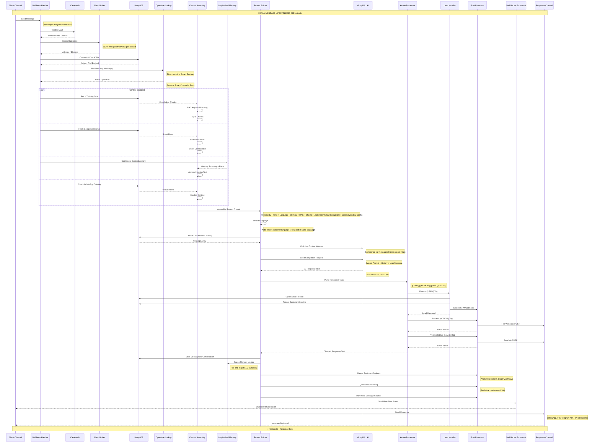

# VOID Platform - Message Handling Flow

Complete end-to-end flow of how a message is processed from arrival to response delivery.

```mermaid
sequenceDiagram
    participant Client as Client Channel
    participant Webhook as Webhook Handler
    participant Auth as Clerk Auth
    participant Rate as Rate Limiter
    participant DB as MongoDB
    participant Worker as Operative Lookup
    participant Context as Context Assembly
    participant Memory as Longitudinal Memory
    participant Prompt as Prompt Builder
    participant AI as Groq LPU AI
    participant Actions as Action Processor
    participant Lead as Lead Handler
    participant Post as Post-Processor
    participant Broadcast as WebSocket Broadcast
    participant Channel as Response Channel

    Note over Client,Channel: 🔄 FULL MESSAGE LIFECYCLE (60-200ms total)

    %% Phase 1: Ingestion
    Client->>Webhook: Send Message
    Note right of Webhook: WhatsApp/Telegram/Web/Email
    
    Webhook->>Auth: Validate JWT
    Auth-->>Webhook: Authenticated User ID
    
    Webhook->>Rate: Check Rate Limit
    Note right of Rate: 100/hr web | 60/hr WA/TG per contact
    Rate-->>Webhook: Allowed / Blocked
    
    Webhook->>DB: Connect & Check Trial
    DB-->>Webhook: Active / Trial Expired
    
    %% Phase 2: Operative Resolution
    Webhook->>Worker: Find Matching Worker(s)
    Note right of Worker: Direct match or Smart Routing
    
    Worker-->>Webhook: Active Operative
    Note right of Worker: Persona, Tone, Channels, Tools
    
    %% Phase 3: Context Assembly (Parallel)
    par Context Sources
        Webhook->>DB: Fetch TrainingData
        DB-->>Context: Knowledge Chunks
        Context->>Context: RAG Keyword Ranking
        Context->>Context: Top 5 Chunks
    and
        Webhook->>DB: Fetch GoogleSheet Data
        DB-->>Context: Sheet Rows
        Context->>Context: Relevance Filter
        Context->>Context: Sheet Context Text
    and
        Webhook->>Memory: Get/Create ContactMemory
        Memory-->>Context: Memory Summary + Facts
        Context->>Context: Memory Injection Text
    and
        Webhook->>DB: Check WhatsApp Catalog
        DB-->>Context: Product Items
        Context->>Context: Catalog Context
    end
    
    %% Phase 4: Prompt Construction
    Context->>Prompt: Assemble System Prompt
    Note right of Prompt: Personality + Tone + Language | Memory + RAG + Sheets | Lead/Action/Email Instructions | Context Window Config
    
    Prompt->>Prompt: Detect Language
    Note right of Prompt: Auto-detect customer language | Respond in same language
    
    %% Phase 5: Context Window Optimization
    Prompt->>DB: Fetch Conversation History
    DB-->>Prompt: Message Array
    
    Prompt->>AI: Optimize Context Window
    Note right of AI: Summarize old messages | Keep recent intact
    
    %% Phase 6: AI Inference
    Prompt->>AI: Send Completion Request
    Note right of AI: System Prompt + History + User Message
    
    AI-->>Prompt: AI Response Text
    Note right of AI: Sub-100ms on Groq LPU
    
    %% Phase 7: Action Processing
    Prompt->>Actions: Parse Response Tags
    Note right of Actions: [LEAD:] | [ACTION:] | [SEND_EMAIL:]
    
    Actions->>Lead: Process [LEAD:] Tag
    Lead->>DB: Upsert Lead Record
    Lead->>DB: Trigger Sentiment Scoring
    Lead->>Post: Sync to CRM Webhook
    Lead-->>Actions: Lead Captured
    
    Actions->>Post: Process [ACTION:] Tag
    Post->>Channel: Fire Webhook POST
    Post-->>Actions: Action Result
    
    Actions->>Post: Process [SEND_EMAIL:] Tag
    Post->>Channel: Send via SMTP
    Post-->>Actions: Email Result
    
    Actions-->>Prompt: Cleaned Response Text
    
    %% Phase 8: Save & Post-Process
    Prompt->>DB: Save Messages to Conversation
    Prompt->>Memory: Queue Memory Update
    Note right of Memory: Fire-and-forget LLM summary
    
    Prompt->>Post: Queue Sentiment Analysis
    Note right of Post: Analyze sentiment, trigger workflows
    
    Prompt->>Post: Queue Lead Scoring
    Note right of Post: Predictive heat score 0-100
    
    Prompt->>Post: Increment Message Counter
    Prompt->>Broadcast: Send Real-Time Event
    Broadcast-->>Client: Dashboard Notification
    
    %% Phase 9: Response Delivery
    Prompt->>Channel: Send Response
    Note right of Channel: WhatsApp API / Telegram API / Web Response
    
    Channel-->>Client: Message Delivered
    
    Note over Client,Channel: ✅ Complete - Response Sent
```
