# VOID Platform Overview
## The Autonomous Neural Agency

---

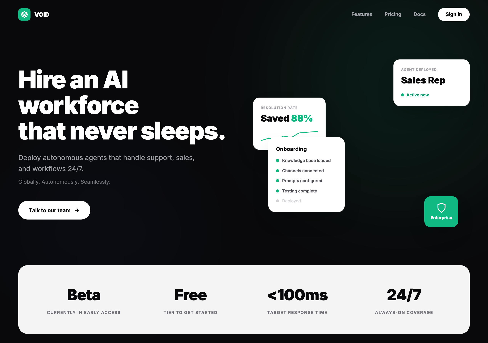

---

## Executive Summary

VOID is a next-generation AI workforce platform designed to replace traditional human support and sales teams with autonomous, high-fidelity AI operatives. Our platform enables businesses to deploy AI agents that handle customer support, sales, and business workflows 24/7.

**Mission:** Provide businesses with a "Synthetic Workforce" that operates with zero latency, 24/7/365, at 1/100th the cost of a human department.

---

## Core Features

### 🤖 AI Agent Deployment
- **Autonomous Agents**: Deploy AI agents that work independently without human intervention
- **Multi-Channel Support**: WhatsApp, Telegram, Web Chat, and Email integration
- **Real-Time Human Takeover**: Proprietary protocol allowing human admins to take control of AI conversations instantly
- **Neural Synthesis**: Personality-injection algorithm that calibrates tone of voice to match your brand identity

### 📊 Fleet Management Dashboard

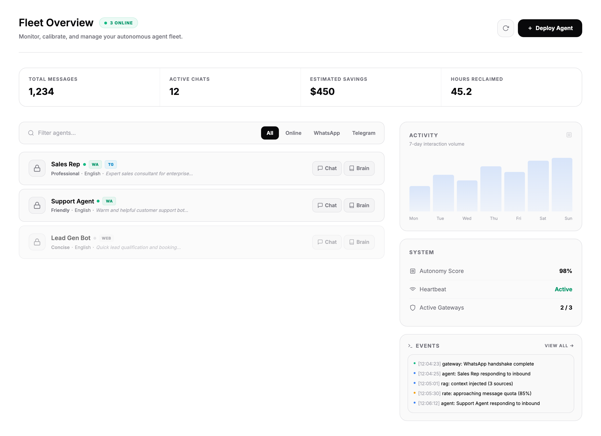

- **Fleet Overview**: Monitor, calibrate, and manage your entire AI agent fleet from one console
- **Real-Time Analytics**: Track messages, active chats, estimated savings, and hours reclaimed
- **System Telemetry**: Autonomy score, heartbeat monitoring, and active gateway tracking
- **Event Logs**: Terminal-style event logging for full transparency

### 📋 Leads CRM

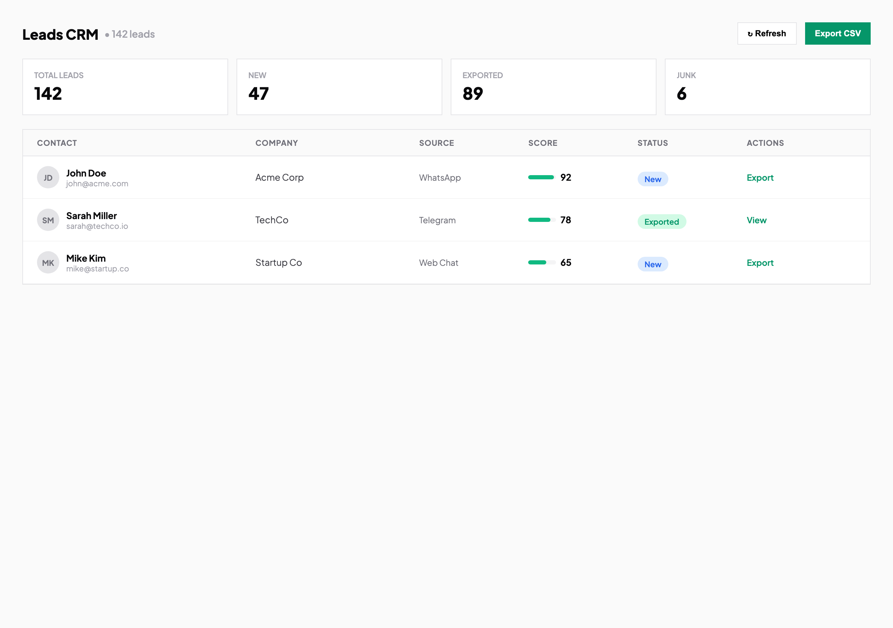

- **Lead Capture**: Automatically capture leads from WhatsApp, Telegram, Web, and Email conversations
- **Lead Scoring**: AI-powered scoring to prioritize high-intent leads (0-100 score)
- **CRM Sync**: Export leads to CSV or sync via webhooks to Salesforce, HubSpot, or custom CRMs
- **Status Management**: Track leads as New, Exported, or Junk with bulk actions
- **Dynamic Segmentation**: AI-powered automatic lead segmentation based on behavior and engagement patterns
- **Bulk Lead Status Update**: Update multiple lead statuses simultaneously for efficient pipeline management
- **Saved Search Filters**: Save and reuse custom search filters for quick lead access
- **Lead Activity Timeline**: Visual timeline tracking all interactions and status changes per lead

### 📧 AI Email Hub

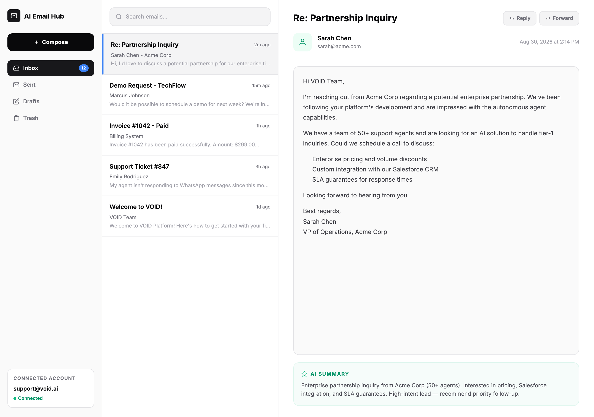

- **Unified Inbox**: Manage all email communications from a single interface
- **AI-Powered Triage**: Automatic email categorization and priority scoring
- **Smart Compose**: AI-assisted email drafting with context from conversations
- **Multi-Account Support**: Connect multiple email accounts with IMAP/SMTP or Gmail OAuth

### 🎯 Mission Control

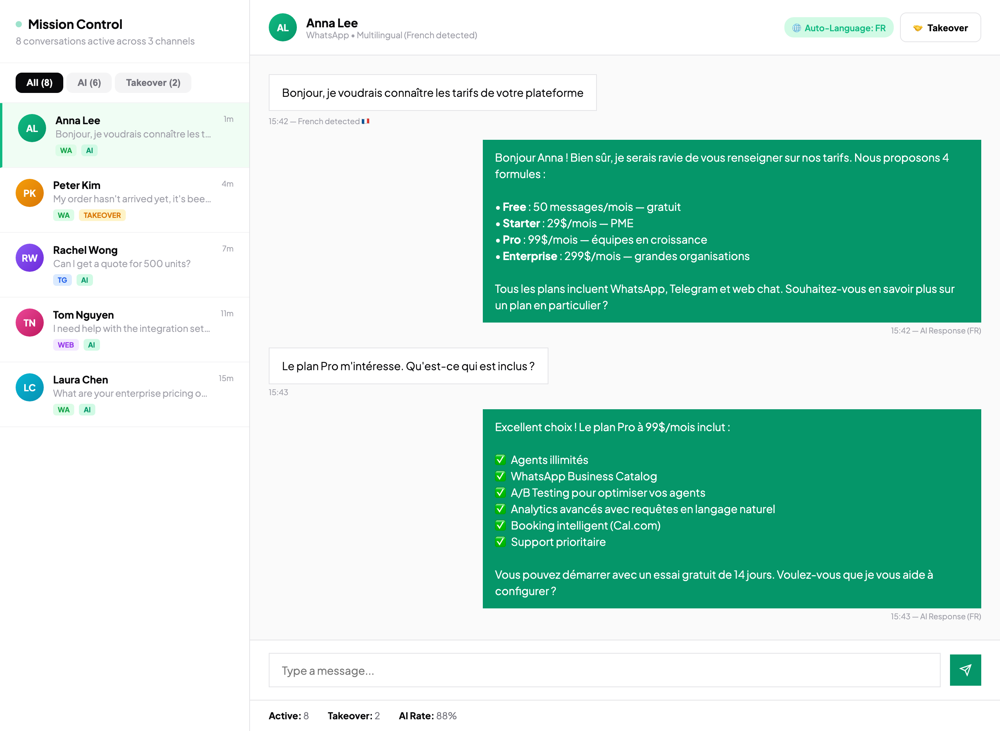

- **Live Monitoring**: Watch AI conversations in real-time across all channels
- **Human Takeover**: Instantly take control of any conversation when needed
- **Channel Visibility**: See which channel (WhatsApp, Telegram, Web, Email) each conversation is on
- **AI Status Tracking**: Monitor whether AI or human is handling each conversation
- **Conversation PDF Export**: Export any conversation to PDF for documentation and record-keeping

### 🧠 Knowledge Base Training

- **Document Ingestion**: Upload PDFs, DOCX, CSV, TXT files, or paste text snippets
- **Web Scraping**: Automatically crawl and ingest web pages to build knowledge
- **RAG Technology**: Retrieval-Augmented Generation ensures accurate, context-aware responses
- **Sovereign Training**: Each company's knowledge core is isolated - data never mixes

### 🔗 Integrations & Webhooks
- **CRM Integration**: Connect with your existing customer relationship management tools
- **Helpdesk Integration**: Seamless integration with popular helpdesk platforms
- **Custom Webhooks**: Build custom integrations for your specific workflow needs
- **API Access**: Full API access for enterprise-level integrations

### 🛒 Marketplace (Synthesis Hub)

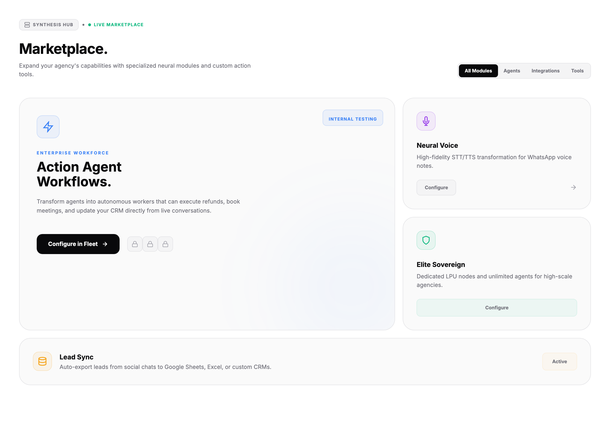

- **Action Agents**: Autonomous workers that execute refunds, book meetings, and update CRMs
- **Neural Voice**: High-fidelity STT/TTS transformation for voice-based interactions
- **Lead Sync**: Auto-export leads from social chats to Google Sheets, Excel, or custom CRMs
- **Custom Modules**: Request custom neural tools for specific business requirements

### 🔒 Security & Privacy

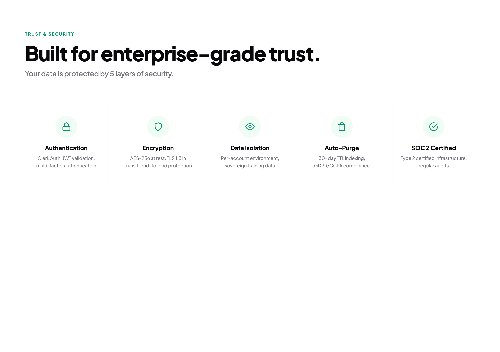

- **Data Isolation**: Every account gets its own environment - data never mixes
- **Encryption**: Data encrypted at rest and in transit using AES-256 protocols
- **Privacy-First**: Your data never trains our models
- **30-Day Auto-Purge**: Automatic data lifecycle management for GDPR/CCPA compliance
- **SOC 2 Certified Infrastructure**: All infrastructure providers are SOC 2 Type 2 certified

---

## 🧠 AI Intelligence Suite *(New)*

VOID's AI Intelligence Suite delivers advanced AI capabilities that go beyond basic chat — enabling autonomous optimization, cross-agent collaboration, and data-driven decision-making.

### 📅 Smart Meeting Booking

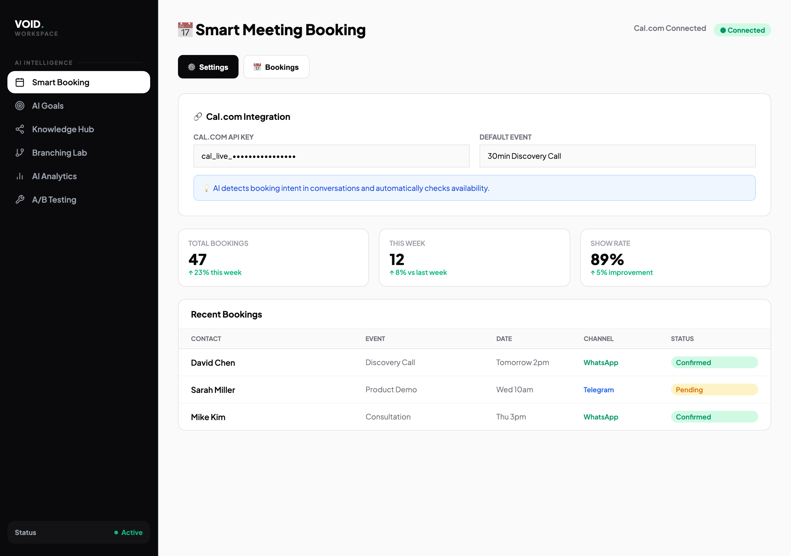

- **Cal.com Integration**: AI automatically detects scheduling intent in conversations and books meetings
- **Intent Detection**: AI recognizes when a customer wants to book a demo, consultation, or meeting
- **Availability Checking**: Real-time calendar availability with time zone support
- **Automated Scheduling**: Seamless booking flow from conversation to confirmed meeting

### 🎯 Autonomous Goal Setting

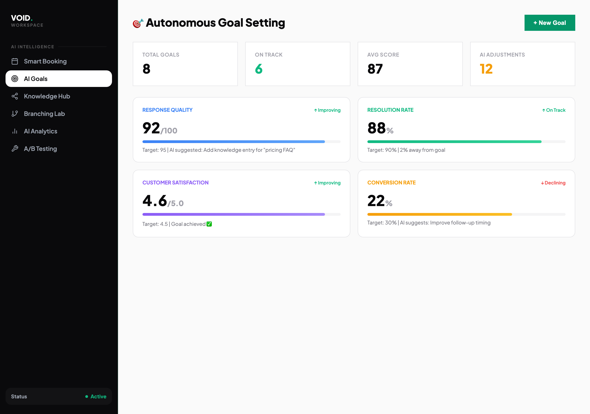

- **AI Self-Optimization**: Agents set and track performance goals autonomously
- **Performance Targets**: Configurable goals for response time, satisfaction, conversion rate
- **Progress Tracking**: Real-time goal progress visualization with AI-driven adjustments
- **Optimization Engine**: AI suggests improvements based on goal performance data

### 🔗 Cross-Agent Knowledge Sharing

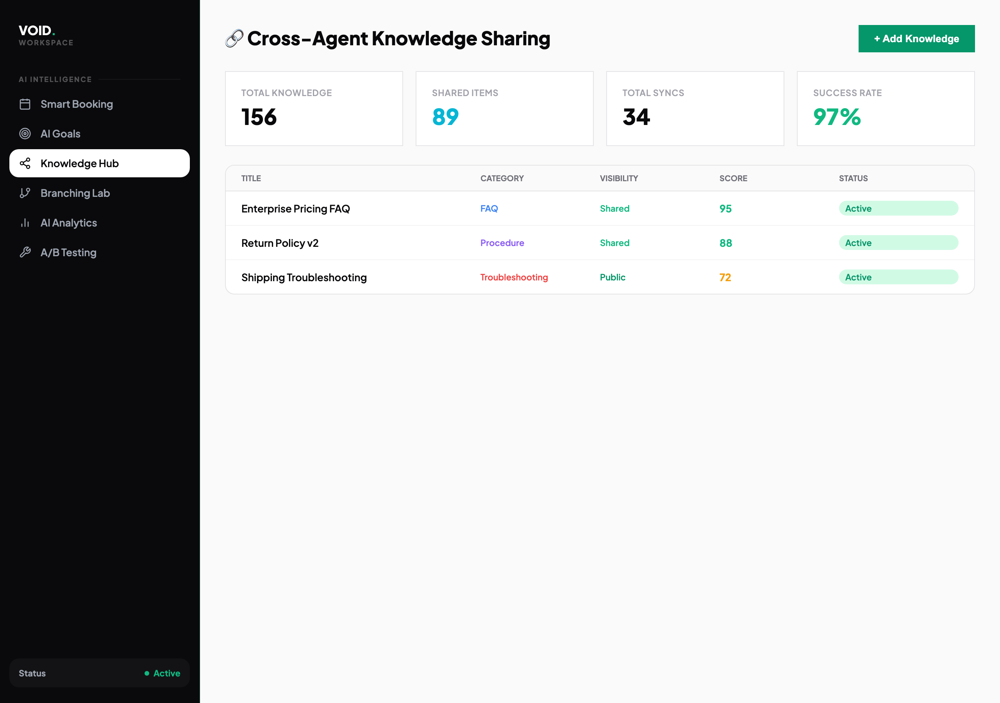

- **Shared Knowledge Graph**: Agents share learned knowledge across the organization
- **Version Control**: Track knowledge evolution with full version history
- **Conflict Resolution**: Intelligent merging when agents learn contradictory information
- **Search & Discovery**: Query the shared knowledge graph across all agents

### 🌿 Conversation Branching Lab
- **What-If Analysis**: Test alternative agent responses in simulated scenarios
- **Performance Comparison**: Compare different conversation strategies side-by-side
- **Optimization Insights**: AI-recommended improvements based on branching analysis
- **Risk-Free Experimentation**: Test changes without affecting live conversations

### 📊 Natural Language Analytics

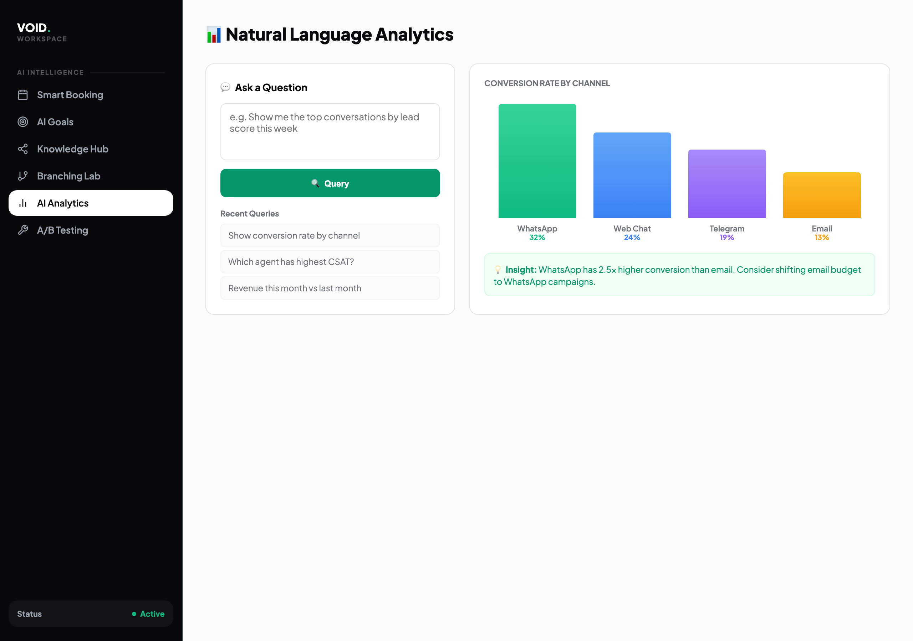

- **Plain English Queries**: Ask questions about your data in natural language
- **Instant Charts**: AI generates visualizations from natural language descriptions
- **Automated Insights**: AI identifies trends, anomalies, and opportunities in your data
- **Multi-Dimensional Analysis**: Explore data across agents, channels, time periods, and metrics

---

## 🌐 Multi-Language Auto-Detection *(New)*

- **Automatic Language Detection**: AI detects customer language and responds in the same language
- **Fast Heuristics**: Character patterns and word matching detect 90%+ of languages with zero token cost
- **LLM Fallback**: Uses AI only for ambiguous text with minimal token usage
- **30+ Languages**: Supports English, Spanish, French, German, Portuguese, Chinese, Japanese, Korean, Arabic, Hindi, and 20+ more
- **Translation Endpoint**: Human agents can translate conversations in real-time during takeover
- **Multi-Channel**: Works across web chat, WhatsApp, and Telegram

---

## 🧪 Agent A/B Testing *(New)*

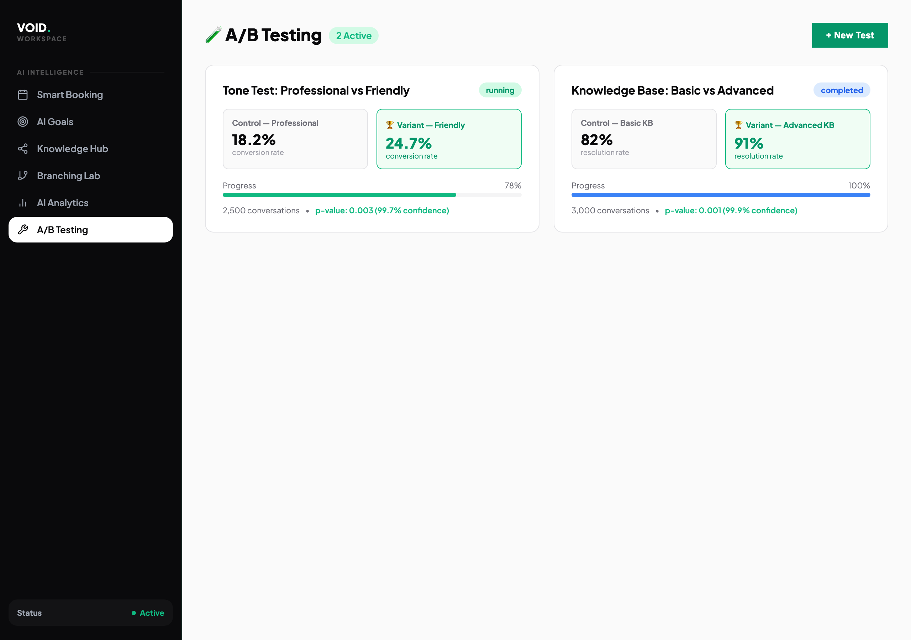

- **Traffic Splitting**: Deterministic hashing ensures same customer always sees same variant
- **Variant Overrides**: Customize personality, tone, language, and knowledge base per variant
- **Statistical Significance**: Built-in Z-test for proportions with 95% confidence level
- **Real-Time Metrics**: Track conversations, conversions, satisfaction, and response times per variant
- **Winner Detection**: AI recommends winning variant based on primary metric
- **Full Dashboard**: Create, monitor, and analyze A/B tests from `/dashboard/ab-tests`

---

## 💾 Conversation Context Windowing *(New)*

- **Smart Memory**: Automatically summarizes older messages to stay within token limits
- **Importance Scoring**: AI scores messages by importance (actions, leads, decisions, questions)
- **Sliding Window**: Keeps recent messages intact while summarizing older context
- **Token Optimization**: Reduces token usage by 40-60% without losing critical context
- **Configurable Per Agent**: Each agent can have custom windowing settings
- **LLM Summarization**: High-quality summaries that preserve names, decisions, and action items

---

## 📦 WhatsApp Business Catalog Integration *(New)*

- **Product Catalog Sync**: Sync your WhatsApp Business product catalog directly into VOID
- **AI-Powered Recommendations**: Agents can browse and recommend products during conversations
- **Product Search**: Relevance-scored search across title, description, and category
- **Plan Gating**: Available for Pro and Enterprise subscription plans
- **Real-Time Updates**: Catalog data stays in sync with WhatsApp Business

---

## 📈 Advanced CRM Features *(New)*

### 🗺️ Customer Journey Mapping

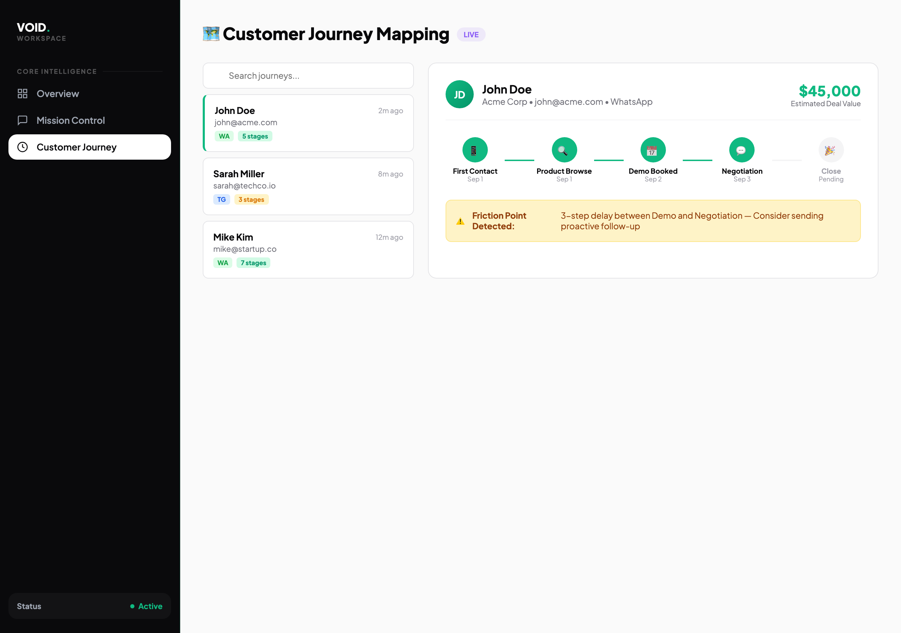

- **Visual Timeline**: Track every customer touchpoint from first contact to conversion
- **Friction Point Detection**: Identify where customers stall or drop off
- **Channel Attribution**: See which channels drive the most value at each stage
- **Funnel Optimization**: Use real conversation data to reduce drop-off rates

### 🎯 Predictive Lead Scoring v2.0
- **Deal Value Estimation**: AI predicts potential deal value alongside lead score
- **Multi-Factor Scoring**: Combines engagement, intent signals, and historical patterns
- **Dynamic Updates**: Scores update in real-time as new interactions occur
- **Pipeline Integration**: Scores feed directly into deal pipeline management

### ⚡ Automated Deal Pipeline Management
- **Stage Automation**: Automatically move deals through pipeline stages based on AI analysis
- **Deal Velocity Tracking**: Monitor how fast deals progress through each stage
- **Revenue Forecasting**: AI-powered revenue projections based on pipeline data
- **Win/Loss Analysis**: Track and analyze won and lost deals for pattern insights

### 😊 Sentiment-Triggered Workflows

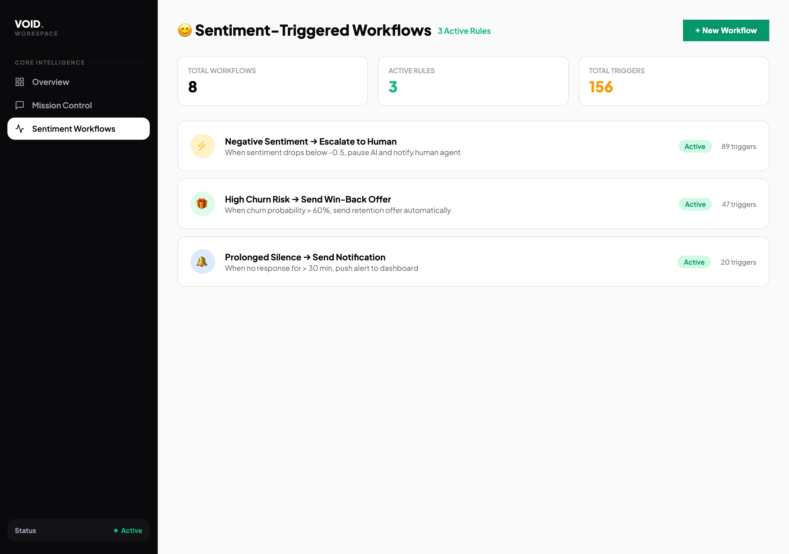

- **Real-Time Sentiment Analysis**: AI detects customer sentiment in every message
- **Proactive Retention**: Automatically trigger retention workflows when negative sentiment is detected
- **Escalation Rules**: Route frustrated customers to human agents instantly
- **Positive Reinforcement**: Trigger upsell workflows when sentiment is high

### 💬 AI Conversation Summary
- **Automatic Summaries**: AI generates concise summaries of every conversation
- **Key Information Extraction**: Names, emails, decisions, and action items captured
- **Searchable Summaries**: Find conversations by content without reading full threads
- **Handoff Context**: Summaries ensure smooth transitions between AI and human agents

### 📅 Smart Follow-Up Scheduler
- **AI-Powered Scheduling**: AI determines optimal follow-up timing based on conversation context
- **Automated Reminders**: Never miss a follow-up with intelligent scheduling
- **Channel-Aware**: Follow-ups are sent on the same channel the conversation occurred
- **Priority-Based**: Urgent leads get faster follow-ups automatically

---

## 📊 Advanced Analytics Suite *(New)*

### 💰 Revenue Attribution Analytics

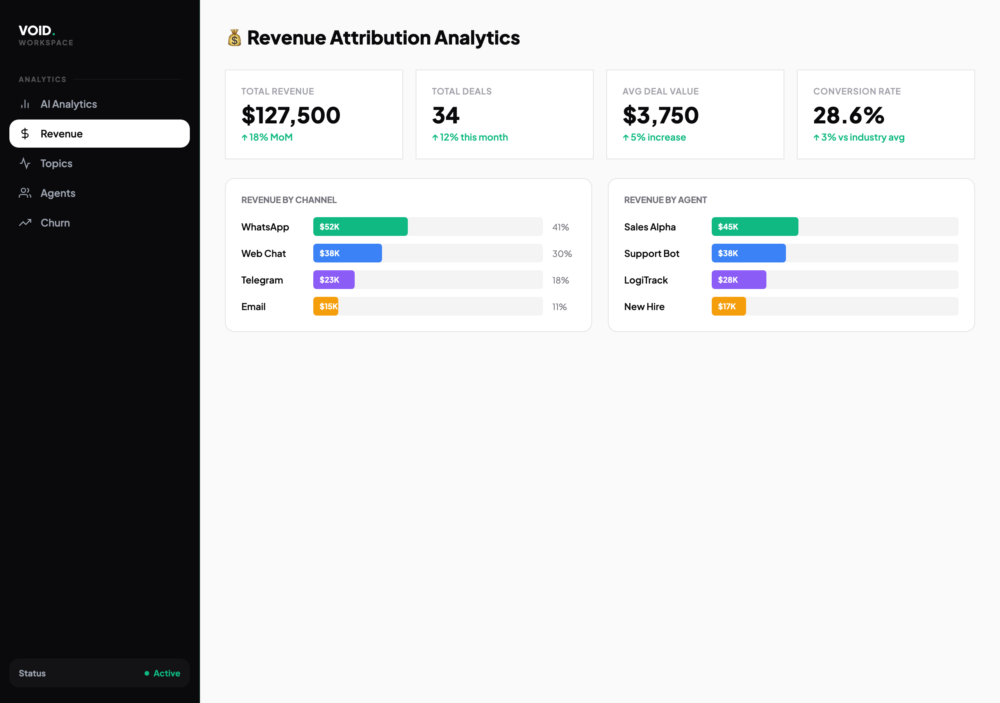

- **Revenue Tracking**: Attribute revenue to specific agents, channels, and conversations
- **ROI Calculation**: Measure return on investment for each AI agent
- **Channel Performance**: Compare revenue generation across WhatsApp, Telegram, Web, and Email
- **Time-Based Analysis**: Revenue trends over daily, weekly, and monthly periods

### 🔍 Topic Clustering & Trend Detection
- **Automatic Topic Discovery**: AI clusters conversations by topic without manual tagging
- **Trend Detection**: Identify emerging topics and customer concerns in real-time
- **Volume Tracking**: Monitor topic volume changes over time
- **Emerging Issues**: Get alerted when new topics spike in frequency

### 📈 Agent Performance Analytics
- **Per-Agent Metrics**: Individual performance scores for each AI agent
- **Response Quality**: Track resolution rates, satisfaction scores, and efficiency
- **Comparative Analysis**: Compare agent performance across similar workloads
- **Improvement Recommendations**: AI suggests specific improvements per agent

### 📉 Churn Analytics
- **Churn Prediction**: AI identifies customers at risk of churning
- **Churn Reasons**: Automatically categorize why customers are leaving
- **Retention Metrics**: Track retention rates across channels and agents
- **Recovery Workflows**: Trigger automated win-back campaigns

### ✅ Conversation Quality Analytics
- **Quality Scoring**: Automated quality assessment for every conversation
- **Compliance Monitoring**: Ensure agents follow brand guidelines and policies
- **Resolution Tracking**: Monitor first-contact resolution rates
- **Customer Satisfaction**: Aggregate CSAT scores with trend analysis

---

## 🚀 Platform Enhancements *(New)*

### 🆓 14-Day Free Trial
- **Full Access**: Try all platform features during the trial period
- **No Credit Card Required**: Start immediately without payment information
- **Seamless Upgrade**: Convert to paid plan with one click after trial

### 📊 Plan-Based Rate Limits & Usage Quotas
- **Tiered Limits**: Usage quotas aligned with subscription plans (Free, Starter, Pro, Enterprise)
- **Real-Time Monitoring**: Track usage against plan limits in the dashboard
- **Smart Alerts**: Get notified before hitting plan limits
- **Graceful Degradation**: Helpful messages when approaching or exceeding limits

### 📋 Centralized Error Logging
- **Unified Logging**: All errors captured in one centralized logging system
- **Error Categorization**: Automatic categorization by severity and type
- **Stack Traces**: Full debugging information for technical issues
- **Alert Integration**: Configurable alerts for critical errors

### 💳 Enhanced Invoicing
- **Payment Method Selection**: Two-step invoice flow — select payment method, then confirm
- **Mark as Paid**: Manual payment confirmation with payment method tracking
- **Invoice History**: Full invoice history with payment status
- **Revenue Integration**: Invoices feed into revenue attribution analytics

### 📰 Admin Blog & News
- **Content Management**: Admin pages for managing blog posts and news articles
- **Public Publishing**: Blog content accessible to public visitors
- **SEO Optimized**: Structured data and meta tags for search engine visibility

### 🏢 Public Company Pages
- **Company Profiles**: Public-facing pages for partner companies
- **Case Studies**: Showcase success stories and use cases
- **Footer Navigation**: Accessible from the site footer for all visitors

---

## How It Works

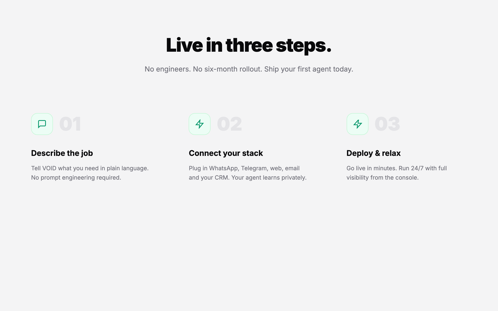

### Step 1: Describe the Job
Tell VOID what you need in plain language. No prompt engineering required.

### Step 2: Connect Your Stack
Plug in WhatsApp, Telegram, web, email and your CRM. Your agent learns privately.

### Step 3: Deploy & Relax
Go live in minutes. Run 24/7 with full visibility from the console.

---

## Use Cases

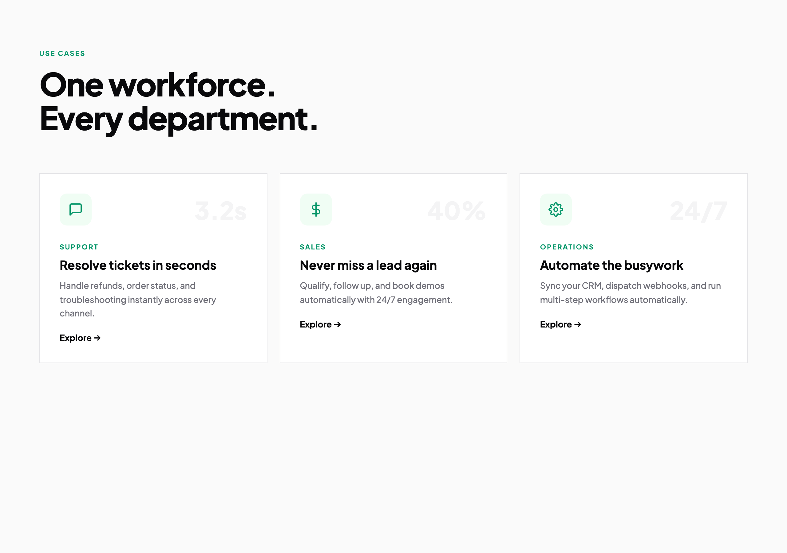

### 🎧 Customer Support
- Resolve tickets in seconds across every channel
- Handle refunds, order status, and troubleshooting instantly
- 24/7 availability without human intervention
- Multi-language support for global customers

### 📈 Sales & Lead Generation
- Never miss a lead again with 24/7 outbound engagement
- Qualify, follow up, and book demos automatically
- 40% increase in sales conversion through instant engagement
- Predictive lead scoring with deal value estimation
- Automated deal pipeline management

### ⚙️ Operations Automation
- Automate busywork and repetitive tasks
- Sync your CRM, dispatch webhooks, and run multi-step workflows
- Zero human intervention required for routine operations
- Sentiment-triggered workflows for proactive customer retention

---

## Onboarding Experience

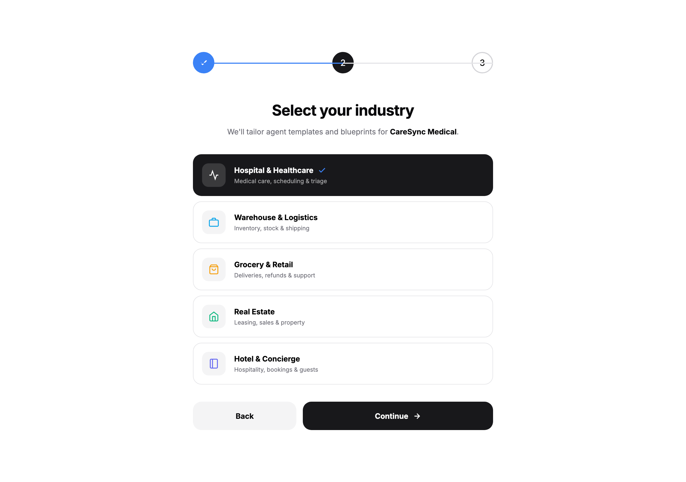

### Streamlined 3-Step Process:
1. **Business Name**: Enter your organization name
2. **Industry Selection**: Choose from Healthcare, Logistics, Retail, Real Estate, or Hospitality
3. **Create First Agent**: Name your agent and select communication tone

---

## Chat Interface

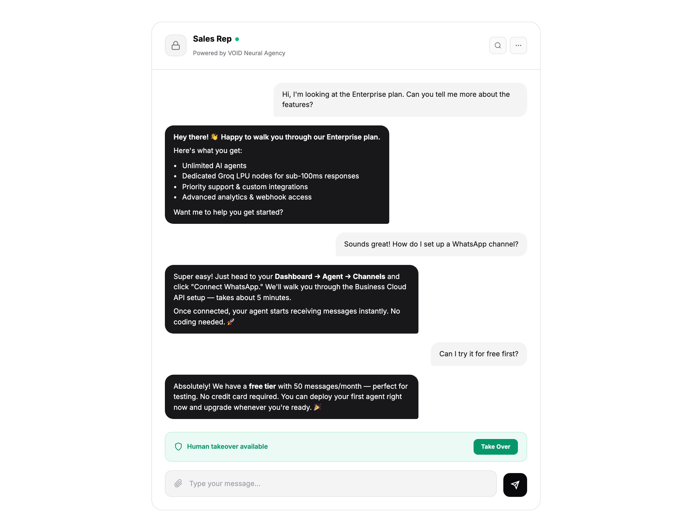

### Real-Time AI Conversations
- **Instant Responses**: Sub-100ms response times powered by Groq LPU
- **Human Takeover**: Seamless handoff to human agents when needed
- **Multi-Channel**: Same agent works across WhatsApp, Telegram, Web, and Email
- **Context-Aware**: RAG-powered responses that stay on-brand and accurate
- **Multi-Language**: AI automatically detects and responds in the customer's language
- **Context Windowing**: Smart memory that preserves key context across long conversations

---

## Target Industries

| Industry | Use Case |
|----------|----------|
| **E-Commerce (Shopify/DTC)** | Complex order tracking and product recommendations on WhatsApp |
| **SaaS (B2B)** | Instant technical support and documentation retrieval |
| **High-Ticket Sales** | Initial lead qualification and appointment setting |
| **Internal Knowledge** | Employee-facing bots for HR and Policy lookup |
| **Healthcare** | Medical care, scheduling & triage support |
| **Warehouse & Logistics** | Inventory, stock & shipping inquiries |
| **Grocery & Retail** | Deliveries, refunds & support, product catalog browsing |
| **Real Estate** | Leasing, sales & property inquiries |
| **Hotel & Concierge** | Hospitality, bookings & guest services |

---

## Technology Stack

- **Inference Engine**: Powered by Groq LPU (Language Processing Unit) with sub-100ms response times
- **Neural Memory**: Retrieval-Augmented Generation (RAG) for accurate, context-aware responses
- **Integration Layer**: Custom-built webhooks for WhatsApp Business Cloud API and Telegram Bot API
- **Data Lifecycle**: Automated MongoDB TTL indexing for 30-day data purging
- **Multi-Language Engine**: Heuristic + LLM hybrid language detection with 30+ language support
- **A/B Testing Engine**: Deterministic traffic splitting with statistical significance testing
- **Context Windowing**: Smart conversation memory with importance scoring and LLM summarization

---

## Competitive Advantage

| Feature | Legacy Bots (Intercom/Zendesk) | VOID Neural Agency |
|---------|-------------------------------|-------------------|
| **Response Speed** | 2-5 Seconds (High Latency) | <100ms (Instant) |
| **Human In Loop** | Ticket Escalation (Slow) | Live Takeover (Instant) |
| **Training** | Manual Rule-Sets | Auto-Web Scraping/Doc Ingestion |
| **UI/UX** | Generic Dashboard | Premium "Neural Lab" Aesthetic |
| **Data Privacy** | Indefinite Storage | 30-Day Auto-Purge Protocol |
| **Multi-Language** | Manual Setup | Auto-Detection (30+ Languages) |
| **Optimization** | Manual A/B Testing | AI-Powered A/B Testing with Statistical Significance |
| **Memory** | Limited Context | Smart Context Windowing with Summarization |
| **CRM** | Basic Contact Storage | Predictive Scoring, Journey Mapping, Deal Pipeline |
| **Analytics** | Basic Metrics | Natural Language Queries, Topic Clustering, Revenue Attribution |

---

## Pricing

- **Free Tier**: 50 messages/month - Perfect for testing (14-day free trial available)
- **Starter**: $29/month - For small businesses
- **Pro**: $99/month - For growing teams (includes WhatsApp Catalog)
- **Enterprise**: $299/month - For large organizations (includes AI Intelligence Suite)

All plans include WhatsApp, Telegram, and web chat integration. Plan-based rate limits and usage quotas apply.

---

## Getting Started

1. **Sign Up**: Create your account at void.ai (14-day free trial, no credit card required)
2. **Onboarding**: Complete the 3-step onboarding process
3. **Train**: Upload documents or connect web pages to build your knowledge base
4. **Deploy**: Connect your communication channels and go live
5. **Optimize**: Use A/B testing, analytics, and AI goals to continuously improve
6. **Scale**: Add more agents and explore the AI Intelligence Suite

---

## Support & Documentation

- **Documentation**: Comprehensive guides and tutorials available in-app
- **Support**: 24/7 support available through the dashboard
- **Community**: Join our community of early adopters and share best practices

---

## Contact

- **Website**: void.ai
- **Email**: support@void.ai
- **Sales**: sales@void.ai

---

*VOID - Hire an AI workforce that never sleeps.*

*The synthesis has begun.*

*Last Updated: September 3, 2026*
