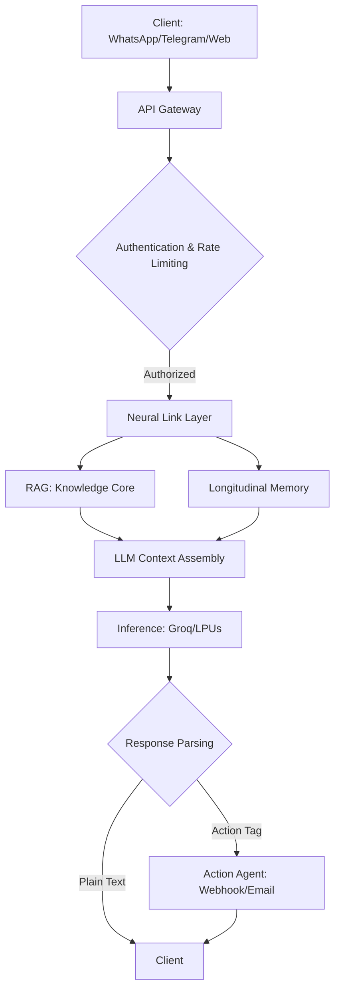

# VOID Technical Documentation & Architecture

This document outlines the core technical architecture, AI algorithms, and operational workflows of the VOID platform—a premium, autonomous neural agency.

---

## 1. System Architecture Overview

VOID is built on a modern **Next.js 15+ (App Router)** foundation with a **MongoDB** persistence layer. It is designed to be "stateless yet context-aware," utilizing a rolling memory layer rather than a traditional session-based history.



---

## 2. AI Algorithms

### 2.1 RAG (Retrieval Augmented Generation)
VOID implements a specialized RAG ingestion pipeline designed for high-performance retrieval from unstructured company documents.

**The Ingestion Algorithm:**
- **Chunking**: Documents are split into overlapping blocks (default: 1000 chars, 200 overlap) to preserve semantic continuity.
- **Metadata Tagging**: Each chunk is indexed with the source file, worker identity, and sequence index.

**The Retrieval Algorithm (Keyword Ranker):**
Instead of expensive vector embeddings for small datasets, VOID uses a high-performance **Keyword-based Frequency Ranker** in the chat route:
1. **Tokenization**: The user query is cleaned and tokenized.
2. **Frequency Matching**: Chunks are ranked based on the density of query keywords.
3. **Context Injection**: The top 5 most relevant chunks are injected into the LLM system prompt.

```typescript
// Rank chunks based on keyword matches
const rankedChunks = trainingDocs.map(doc => {
  let score = 0;
  keywords.forEach((word: string) => {
    if (doc.content.toLowerCase().includes(word)) score++;
  });
  return { content: doc.content, score };
})
.filter(chunk => chunk.score > 0)
.sort((a, b) => b.score - a.score)
.slice(0, 5);
```

### 2.2 Longitudinal Memory Layer
This algorithm enables "recall" across multi-day conversations by distilling history into a persistent user profile.

**The Memory Algorithm:**
1. **Recall**: Every request retrieves the `ContactMemory` record for the specific user/channel.
2. **Injection**: Facts and summaries are added to the system prompt (e.g., "User's favorite tool: Webhooks").
3. **Consolidation**: After the response is sent, a non-blocking process (fire-and-forget) uses the LLM to update the user's profile based on the new exchange.

```typescript
// Memory Consolidation Prompt Snippet
const summarizePrompt = `
Instructions:
1. Update the memory summary (max 200 words) with new relevant information.
2. Extract any new KEY FACTS as a JSON array of strings.
Respond in this JSON format: {"summary": "...", "newFacts": ["..."]}
`;
```

---

## 3. Technical Workflows

### 3.1 Action Agent Execution
Action Agents use an "Intercept and Execute" pattern. The AI identifies tasks (e.g., "Refund order") and outputs a structured tag.

**Workflow:**
1. AI outputs: `[ACTION: refund_process, {"id": "123"}]`
2. Backend matches `refund_process` to a configured Webhook URL.
3. System executes a secure `POST` request to the target business system.
4. Response is logged and the tag is cleaned from the user's view.

```typescript
// Action Parsing Logic
if (aiResponse.includes('[ACTION:')) {
  const match = aiResponse.match(/\[ACTION:\s*([^,]+),\s*([^\]]+)\]/);
  const actionName = match[1].trim();
  const configuredAction = worker.actions?.find(a => a.name === actionName);
  
  if (configuredAction?.webhookUrl) {
    await fetch(configuredAction.webhookUrl, {
      method: 'POST',
      body: JSON.stringify({ action: actionName, payload })
    });
  }
}
```

### 3.2 Subscription Access Control
VOID uses a Tiered Permission Matrix to gate premium features.

| Feature | Free | Pro | Enterprise |
| :--- | :--- | :--- | :--- |
| Max Workers | 1 | 3 | 10 |
| Memory Layer | No | Short-term | Long-term |
| WhatsApp | No | No | Yes |
| Custom Actions | No | No | Yes |

---

## 4. Key Implementation Snippets

### 4.1 Rate Limiting (MongoDB Window)
A high-performance rate limiter that avoids the need for Redis by using MongoDB's `$inc` and `expiresAt` (TTL) logic.

```typescript
record = await RateLimit.findOneAndUpdate(
  { identifier },
  {
    $setOnInsert: { expiresAt },
    $inc: { count: 1 }
  },
  { upsert: true, new: true }
);
```

### 4.2 System Guard (Autonomous Observability)
The system monitors its own "Handshakes" (Webhook calls, API requests) and logs failures to a central dashboard for proactive debugging.

```typescript
await SystemLog.create({
  type: 'handshake',
  source: 'ACTION_AGENT',
  message: `Action ${actionName} executed successfully`,
  userId: worker.userId
});
```

---

## 5. Security Architecture
- **JWT Authentication**: Secured via Clerk.
- **Environment Isolation**: STRIPE_SECRET_KEY, GROQ_API_KEY, and MONGO_URI are strictly server-side.
- **Sanitized Ingress**: All file uploads (PDF/DOCX) are parsed and neutralized before ingestion into the Knowledge Core.
